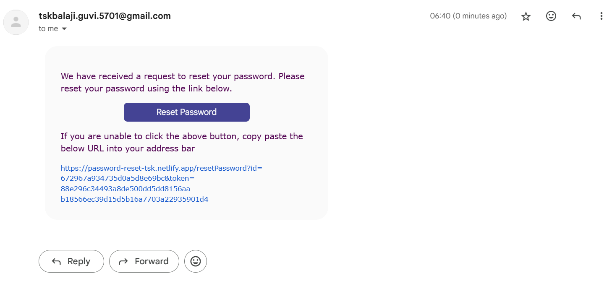

This is a React Project showcasing the functionality of password reset.

**Requirements :**

1. Design a forget password page, where the user enters his e-mail id.
2. Check if the user exists in the DB. If the user is not present send an error message.
3. If the user is found generate a random string and send a link with that random string in the mail Store the random string in DB for later verification.
4. When the user enters that link, retrieve the random string and pass it to DB. Check if the random string matches.
5. If the string matches show the password reset form. Store the new password and clear the random string in the DB once the user submits the form.
6. If the string does not match send an error message. The flow image is given below.

---

## Forgot Password

Reset Link will be sent to available user.

## Mail Content

## Password Reset Successful

